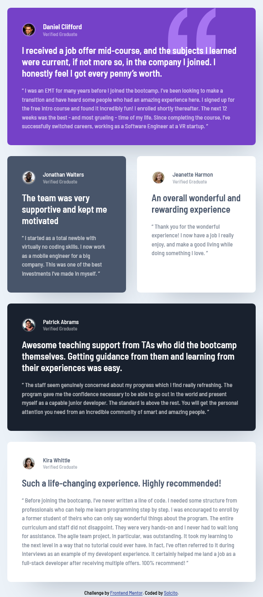
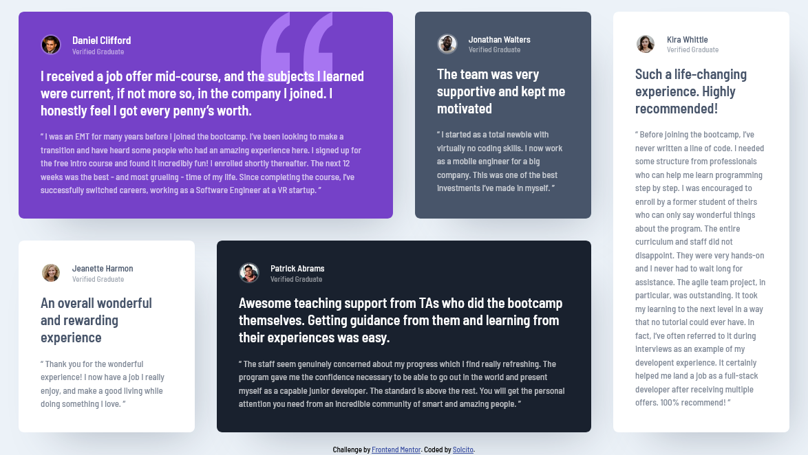

# Frontend Mentor - Testimonials grid section solution

This is a solution to the [Testimonials grid section challenge on Frontend Mentor](https://www.frontendmentor.io/challenges/testimonials-grid-section-Nnw6J7Un7). Frontend Mentor challenges help you improve your coding skills by building realistic projects. 

## The challenge

Users should be able to:

- View the optimal layout for the site depending on their device's screen size

## Screenshots

## Links

- Solution URL: https://www.frontendmentor.io/solutions/testimonials-grid-section-using-css-grid-sUA6jqMwj-
- Live Site URL: https://solch4.github.io/Testimonials-grid-section/

## Built with

- Semantic HTML5 markup
- CSS custom properties
- Flexbox
- CSS Grid
- Mobile-first workflow

## Author

- GitHub - [@solch4](https://github.com/solch4/)
- Frontend Mentor - [@solch4](https://www.frontendmentor.io/profile/solch4)
- LinkedIn - [Sol Maldonado](https://www.linkedin.com/in/sol-maldonado-fullstack/)